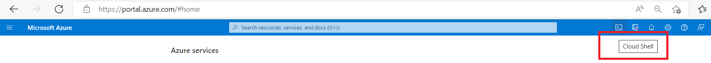
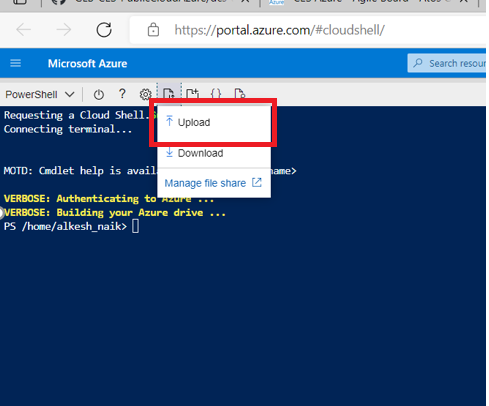
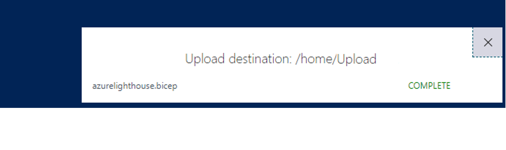

# azureLighthouse/azureLighthouse.bicep
Bicep module to onboard customer tenant on to the Eviden MSP.

## Description

Azure lighthouse enables cross tenant access beneficial for operations team. With Azure lighthouse the users can use single credential to view multiple customers in one tenant view.

This module will allow clients to activate the azure lighthouse onboarding.
This is per `subscription`.

## Points to note
This bicep file needs to run on the customer subscription that needs to be onboarded.
The user performing this will need to have owner permissions on the subscription.

## How to execute the module

The user can run the script by using the cloud shell in Azure as it comes preinstalled with bicep.


On clicking the cloud shell shown in the above image, an interactive editor opens at the bottom of the browser. if its the first time it will ask `bash` or `powershell`.
It will ask for a storage account to be created. Select the "Create Account" and it will start the interactive shell editor.
Once the editor is ready select the below button to upload the files to the shell , this can be done by dragging and dropping the files also. It has to be done one by one.



Below are the files that need to be present.
- azureLighthouse.bicep
- bicepconfig.json
- *.params.json

After uploading the files you will get a confirmation message like below




Once the files are in place run the below comand in powershell to check if everything looks good.

```hcl
Test-AzSubscriptionDeployment -Location '<location prefered>' -TemplateFile azureLighthouse.bicep -TemplateParameterFile *.params.json
```
If the above command does not return anything then there is no error and we can move to the acutal deployment. If the above command returns an error fix the error before the actual deployment.
Below is the command to be run for the lighthouse onboarding

```hcl
New-AzSubscriptionDeployment -Location '<location prefered>' -TemplateFile azureLighthouse.bicep -TemplateParameterFile *.params.json
```

## Module Arguments

|  Name | Type | Required | Description |
| --- | --- | --- | --- |
| `mspOfferName` | `string` | true | Specifies the name of the offer |
| `mspOfferDescription` | `string` | true | Description of the offer |
| `managedByTenantId` | `string` | true | The Tenant if where the operatons will login to see the subscriptions for the customer.  |
| `authorizations` | `array` | true | The collection of authorization objects describing the access Azure Active Directory principals in the managedBy tenant will receive on the delegated resource in the managed tenant. Additional Details [here](#array---authorizations).|
| `eligibleAuthorizations` | `array` | true | The collection of eligible authorization objects describing the just-in-time access Azure Active Directory principals in the managedBy tenant will receive on the delegated resource in the managed tenant. Additional Details [here](#array---eligibleauthorizations).|

### Array - authorizations
 Name | Type  | Description |
| --- | --- | --- |
| `principalId` | `string`|The object id (principal id) of the application or user in the Azure Tenant|
| `roleDefinitionId` | `string`|The role definition id of the role in Azure eg. Reader role is `acdd72a7-3385-48ef-bd42-f606fba81ae7`|
| `principalIdDisplayName` | `string`|The display name of the Azure Active Directory principal.|
| `delegatedRoleDefinitionIds` | `string[]`| false|The delegatedRoleDefinitionIds field is required when the roleDefinitionId refers to the User Access Administrator Role. It is the list of role definition ids which define all the permissions that the user in the authorization can assign to other principals.|

### Array - eligibleAuthorizations
 Name | Type  | Description |
| --- | --- | --- |
| `principalId` | `string`|The object id (principal id) of the application or user in the Azure Tenant|
| `roleDefinitionId` | `string`|The identifier of the Azure built-in role that defines the permissions that the Azure Active Directory principal will have on the projected scope. eg. Reader role is `acdd72a7-3385-48ef-bd42-f606fba81ae7`|
| `principalIdDisplayName` | `string`|The display name of the Azure Active Directory principal.|
| `justInTimeAccessPolicy` | `object`|The just-in-time access policy setting. Additional Details [here](#object---justintimeaccesspolicy).|

#### Object - justInTimeAccessPolicy
 Name | Type  | Description |
| --- | --- | --- | 
| `multiFactorAuthProvider` | `string`|The multi-factor authorization provider to be used for just-in-time access requests. Values 'Azure' or 'None'|
| `maximumActivationDuration` | `string`|The maximum access duration in ISO 8601 format for just-in-time access requests.|
| `managedByTenantApprovers` | `array`|The list of managedByTenant approvers for the eligible authorization. Additional Details [here](#array---managedbytenantapprovers).|

##### Array - managedByTenantApprovers
 Name | Type  | Description |
| --- | --- | --- |
| `principalId` | `string`|The object id (principal id) of the application or user in the Azure Tenant|
| `principalIdDisplayName` | `string`|The display name of the Azure Active Directory principal.|


## Module outputs
NA

## Parameters file example
```json
{
	"$schema": "https://schema.management.azure.com/schemas/2018-05-01/subscriptionDeploymentParameters.json#",
	"contentVersion": "1.0.0.0",
	"parameters": {
		"mspOffer": {
			"value": "First Time"
		},
		"mspOfferDescription": {
			"value": "First Time description"
		},
		"managedByTenantId": {
			"value": "a47921a6-a2af-4dc4-ab75-dad1f90abb7e"
		},
		"authorizations": {
			"value": [{
				"principalId": "b202bc71-a5ce-4c94-a59f-7c76f03187fe",
				"roleDefinitionId": "acdd72a7-3385-48ef-bd42-f606fba81ae7",
				"principalIdDisplayName": "Name of the principal"
			}]
		},
		"eligibleAuthorizations": {
			"value": [{
				"justInTimeAccessPolicy": {
					"multiFactorAuthProvider": "Azure",
					"maximumActivationDuration": "PT8H",
					"managedByTenantApprovers": [{
						"principalId": "5add9b65-8d29-4d3b-a71e-5892374ca1b9",
						"principalIdDisplayName": "Eviden Approver Group"
					}]
				},
				"principalId": "b19eb142-a5fa-4324-aec2-0ab782031ea3",
				"principalIdDisplayName": "Contributor",
				"roleDefinitionId": "b24988ac-6180-42a0-ab88-20f7382dd24c"
			}]
		}
	}
}
```