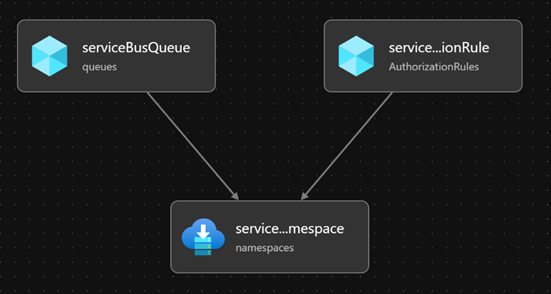

# serviceBus/serviceBus.bicep
Bicep module to create service bus namespace and queues.

## Module Features
This module deploys a service bus namespace resource and queues (1 or more).

## Module overview



## Resource types

| Resource Type | API Version |
| :-- | :-- |
| `Microsoft.ServiceBus/namespaces` | [2021-11-01](https://docs.microsoft.com/en-us/azure/templates/Microsoft.ServiceBus/2021-06-01-preview/namespaces) |
| `Microsoft.ServiceBus/namespaces/AuthorizationRules` | [2021-11-01](https://docs.microsoft.com/en-us/azure/templates/Microsoft.ServiceBus/2017-04-01/namespaces/AuthorizationRules) |
| `Microsoft.ServiceBus/namespaces/queues` | [2021-11-01](https://docs.microsoft.com/en-us/azure/templates/Microsoft.ServiceBus/2021-06-01-preview/namespaces/queues) |

## Module Example Use
```hcl
module exampleServiceBus '../childModules/serviceBus/serviceBus.bicep' = {
  scope: automationResourceGroup
  name: 'deployExampleServiceBus'
  params: {
    name: naming.itsmServiceBus.name
    location:'westeurope'
    skuName: 'Standard'
    authorizationRuleName: 'exampleRuleName'
    authorizationRuleRights: [
        'Manage'
    ]
  }
}
```

## Module Parameters

| Name | Type | Required | Description |
| --- | --- | --- | --- |
| `name` | `string` | true | The Service Bus name. |
| `location` | `string` | true | Specifies the location of the Service Bus. |
| `tags` | `object` | true | A mapping of tags to assign to the resource.  Additional Details [here](#object---tags).|
| `skuName` | `string` | false | The SKU of the Service Bus. Valid options are Basic, Standard & Premium. |
| `zoneRedundant` | `boolean` | false | Enabling this property creates a Premium Service Bus Namespace in regions supported availability zones.|
| `queues` | `array` | false | The queues to create in the Service Bus namespace. |
| `authorizationRuleName` | `string` | false | The name of the authorization rule. See https://docs.microsoft.com/en-us/azure/service-bus-messaging/service-bus-sas for more details on this topic. |
| `authorizationRuleRights` | `string[]` | false | The rights associated with the rule. See https://docs.microsoft.com/en-us/azure/service-bus-messaging/service-bus-sas for more details on this topic. |


### Object - tags
Below is an example of the tags object

`"key"`:`"value"`

**Example:**
```json
{
    "EvidenManaged": "true",
    "Project": "Monitoring Parent Module",
    "ManagedBy": "AzureBicep"
}
```


## Module Outputs

| Name | Description | Value |
| --- | --- | --- |
| `serviceBusName` | The name of the deployed service bus namespace. | `serviceBusNamespace.name` |
| `serviceBusResourceId` | The resource ID of the deployed service bus namespace. | `serviceBusNamespace.id` |
| `resourceGroupName` | The resource group of the deployed service bus namespace. | `resourceGroup().name` |